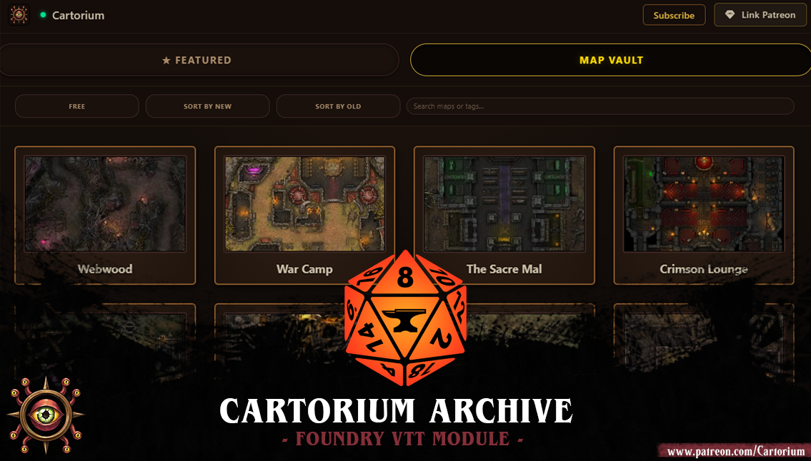

# The Cartorium Archive

Cartorium Archive is the new way to get Cartorium content straight into Foundry VTT. Browse every map we've released and install any of them in a single click, no downloading, no file wrangling. Open it from the Cartorium button above the Scenes tab and have a dig through the collection - there's something in there for everyone: a free selection of maps for anyone who installs it!



## Features

- Every Cartorium map in one place — browse and search the full catalogue inside Foundry
- One-click install — no zips, no file wrangling, no broken paths
- Ready to run — walls, doors, lighting and ambient audio already done
- Perfect grid alignment — baked in on our end, lines up on arrival
- Alternate variants — same walls, different art
- Free to browse — free maps for everyone, no login needed
- Patreon login built in — your tier unlocks automatically
- Patron extras land properly — tokens on the map, notes and statblocks included

<!-- Add a screenshot of the map detail view / tier cards here -->

## Installation

1. Navigate to **Add-on Modules** in Foundry VTT (outside of a Game World)
2. Click **Install Module**
3. Paste the Cartorium Archive manifest URL:

```
https://raw.githubusercontent.com/cartorium/Cartorium-assets/main/cartorium-browser/module.json
```

4. Click **Install**, then enable Cartorium inside your world

## Getting Started

1. Launch a World in Foundry with Cartorium Archive enabled
2. Click the **Cartorium** button above the Scenes tab
3. Click **Map Vault** and start browsing
4. Use the search bar to find a specific map
5. Click a map to enter the details screen
6. Click the variant you want to install
7. Click the **Install Prebuilt Map and Scene** button

This will also install the extra rewards according to your tier.

## Requirements & Compatibility

- **Foundry VTT:** v14
- **Tokens and Statblocks:** 5E only — tokens will still be available on other systems
- **Internet connection:** needed for Patreon validation
- **Patreon Blood Sworn tier:** required for premium notes and tokens

## Support

Need extra help? Or noticed an issue? Find us on our [Discord](https://discord.gg/42PZpF9We) and let us know!

This was a huge undertaking for us! We hope you enjoy the ease and usability of it!

Bigger things to come! Stay tuned! ❤ Cartorium.
